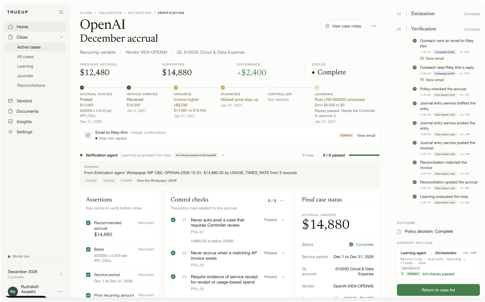

# TrueUp

An agentic accrual engine for the Office of the CFO, built at HackMIT 2026.



All data in this repository is synthetic and every upstream system (ERP, procurement, contracts, AP) is simulated.

## Inspiration

Month-end accruals are one of the most judgment-heavy parts of the close process. Finance teams need to recognize expenses before invoices arrive, but the information needed to do that is scattered across contracts, purchase orders, usage data, receiving records, AP systems, and employees' institutional knowledge.

We built TrueUp to turn that fragmented process into an evidence-driven workflow. Instead of treating every missing invoice the same way, TrueUp recognizes the type of obligation, gathers the right evidence, decides whether to accrue or ask a targeted question, and continually improves its accrual prediction engine when an invoice eventually arrives.

## What it does

TrueUp is an agentic accrual engine for the Office of the CFO. It handles four common vendor-obligation types:

1. **Fixed recurring:** recurring SaaS or software subscriptions, estimated from contract terms and current effective pricing.
2. **Fixed one-time:** one-time purchases such as laptop orders, estimated from approved PO pricing and the quantity actually received.
3. **Dynamic recurring:** usage-based services such as AI/API or cloud usage, estimated from current usage and contractual rates.
4. **Dynamic one-time:** spend such as an advertising campaign, estimated from spend incurred during the close period.

For each obligation, TrueUp can:

- Determine whether an invoice is already in AP, preventing duplicate accruals.
- Gather the evidence required for that obligation type.
- Identify missing or conflicting evidence.
- Send targeted outreach, such as asking Engineering how many laptops were received before month-end.
- Let the procurement team know of incomplete or outdated records in their Contract Lifecycle Management software and Purchase Order databases.
- Produce an explainable accrual recommendation and calculation.
- Apply configurable company policies for evidence requirements, escalation, materiality, and approval.
- Compare an accrual with the later actual invoice in AP.
- Diagnose why an estimate was wrong and propose a replay-tested improvement rule for Controller approval.

For example, if a PO covers 25 laptops for $40,000 but receiving evidence and Engineering confirm that only 20 arrived before month-end, TrueUp accrues $32,000, not the full $40,000.

## How we built it

We designed TrueUp as a hybrid agentic accounting workflow: LLM-backed agents reason over ambiguous documents and unstructured responses, while deterministic code owns dollar calculations, policy decisions, matching thresholds, and accounting controls.

Our architecture includes:

- A normalized synthetic company dataset containing vendors, contracts, POs, operational evidence, AP invoices, and employees.
- A case-based obligation record that represents one potential vendor expense for one close period.
- An Evidence and Outreach workflow that retrieves sparse information, records evidence, identifies gaps, and asks the right internal owner a precise question.
- A deterministic estimation engine with different logic for fixed recurring, fixed one-time, dynamic recurring, and dynamic one-time obligations.
- A machine-readable company policy configuration for evidence requirements, escalation routes, materiality thresholds, permitted estimation methods, and approval controls.
- A reconciliation and learning loop that uses later AP invoices as objective ground truth to improve the estimation engine.
- A human Controller approval step for material accounting judgments and for activating any learned rule.

We also designed the simulator so data appears over time. At a July close, the agent can see July contracts, usage, and goods-receipt evidence, but not invoices that do not arrive until August. That prevents future-data leakage and makes the learning loop meaningful.

## Challenges we ran into

The hardest problem was avoiding an overly broad "AI accountant" product. Accruals touch many systems and exceptions, so we had to reduce the scope to a workflow that was both realistic and buildable during a hackathon.

We also had to balance autonomy with financial controls. An LLM can interpret contract language or summarize an employee response, but it should not invent evidence, choose unsupported accounting treatments, or produce unverified dollar amounts. We addressed that by keeping calculations, policy enforcement, approval thresholds, and posting logic deterministic. Additionally, output formats were forced, unstructured data was converted to structured data rigorously, and a verifying agent externally ensures that agents are working as permitted.

## Accomplishments that we're proud of

We are proud that TrueUp is not just a chatbot that comments on finance data. It executes a real close workflow: it identifies possible obligations, collects evidence, makes an explainable accrual recommendation, handles exceptions, and changes behavior after receiving ground truth.

We are especially proud of:

- Supporting four distinct accrual patterns rather than using one generic estimator.
- Demonstrating a realistic fixed-asset edge case with PO, receiving, and internal-owner confirmation.
- Using later AP invoices as an objective answer key for whether the original estimate was correct.
- Building a constrained self-improvement loop: the system can propose a rule, but it must pass replay testing and receive Controller approval before affecting future cases.
- Separating LLM reasoning from deterministic financial controls so every meaningful decision remains auditable.

## What's next for TrueUp

Our next step is to grow TrueUp from an accrual engine into an accrual-to-AP control plane: a system that continuously connects procurement, invoice intake, receiving, AP, and the month-end close.

The biggest production risk we want to solve is the "invoice hiding in the inbox" problem. An invoice can arrive by email, PDF, portal, EDI feed, or procurement platform but remain unprocessed until after an accrual has already been posted. When it later reaches AP, the company can accidentally recognize the same expense twice.

We want to build an intelligent invoice-intake and AP layer that:

- Ingests invoices from shared AP inboxes, vendor portals, EDI feeds, and document repositories.
- Extracts vendor, invoice number, PO, service period, amount, line items, and payment terms from unstructured documents.
- Matches incoming invoices against open POs, goods receipts, existing AP records, and previously posted accruals.
- Detects potential duplicate expense recognition before an invoice is posted.
- Automatically proposes the correct accrual reversal, AP coding, and exception workflow.
- Routes only genuine exceptions to AP, procurement, service owners, or the Controller.
- Integrates with ERP and procurement systems such as NetSuite, SAP, Coupa, and SAP Ariba, including environments where PO-to-invoice conversion is available.
- Builds a continuously updated view of a company's obligations from commitment through receipt, invoice intake, accrual, payment, reconciliation, and learning.

Longer term, that would make TrueUp a continuously learning close and spend-intelligence layer rather than just a tool that estimates missing invoices at month-end: one that prevents duplicate recognition, improves invoice readiness, and makes the entire procure-to-pay and close process more reliable.

## Run it

The suite and both servers run with no API keys; without one the agents use their rules instead of the model.

```
cd backend && uv sync && uv run python scripts/serve.py      # API on http://localhost:8000
cd frontend/web && npm install && npm run dev                # UI on http://localhost:3000
```

`backend/scripts/serve_live.sh` restarts the API with the model live when a key is configured. Tests: `cd backend && uv run pytest && uv run ruff check .`

## Repository

| Path | What it holds |
|---|---|
| `backend/` | The agents, the close orchestrator, verification gates, simulator and API (`backend/README.md`, `backend/CLAUDE.md`) |
| `frontend/web/` | The Next.js web app |
| `notes/` | [Project description](notes/Project_Description_Target.md), [the hackathon prompt in plain language](notes/hackathon_prompt.md), [what the BenchRec dataset can and cannot do for us](notes/benchrec-cash-rec.md) |
